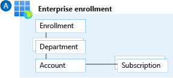

# Enterprise Enrollment and Azure AD Tenants

## List of related features and user stories in the backlog

- #6475
- #6482
- #6483
- #6484
- #6485
- #6486 
- #6487 
- #6488

## Introduction 
  
 
 <customer name> uses one an Enterprise agreement. 

| Role | description |
| ----------------------------------- | -------------------------- |
| EA Admins | This role can view the entire account on all subscriptions. In addition, one can create department admin and accounts. This role has no rights within subscriptions |
| EA Admins Read Only | He can see the entire account of all subscriptions but cannot edit anything. Not yet used within  \<\<customer name>\>ame>\>|
| Department Admins | This role can create accounts under a department. In addition, the DA roll can gain insight into costs incurred from subscriptions / accounts under a department (if enabled DA can view charges). This role also has no rights to subscription. Not currently used within  \<\<customer name>\>ame>\>|
| Accounts | These can actually create new subscriptions and also delete them. Accounts depending on the setting on enrollment have insight into their costs directly in the Azure Portal or via the ea.portal |

See ..... for current  \<\<customer name>\>ame>\>EA portal users and roles. 
  

  
 \<\<customer name>\>ame>\>have 1 hybride identity via tenant <...>.onmicrosoft.com  that is synced via ADConnect with the onsite Active Directory and federated with AD FS Infrastructure.  

 
The advice is to only use these Hybrid identities (Work and School Accounts) within EA environment. Periodically there will be a review of who has access to https://ea.azure.com and verify the roles. 
Setup enterprise Dev/Test/Prod environments at an EA account level to support creation of dev/test workload for active Visual Studio subscribers. See https://docs.microsoft.com/en-us/visualstudio/subscriptions/azure-ea-devtest
  
 
Now the creation of new subscriptions is done manually and they will be placed under the appropriate management group as described in this document.
If desired, you can create automated / scripted subscriptions using service principles by means of billing accounts RBAC rights see [link](https://docs.microsoft.com/en-us/azure/azure-resource-manager/management/programmatically-create-subscription?tabs=azure-powershell)
