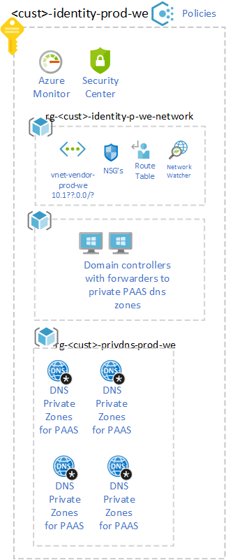

# Identity and Access Management

## List of related features and user stories in the backlog

- #6489
- #6490
- #6491
- #6495
- #6496
- #6498
- #6499
- #6502

## Introduction

Identity and access management (IAM) is boundary security in the public cloud. It must be treated as the foundation of any secure and fully compliant public cloud architecture. 

### Use Azure AD only groups for Azure controle plane.

RBAC for Azure resource access is based on Azure Security Groups, instead of userid. No direct assignments should be done but Azure AD groups that implement the relevant role / RBAC.
If necessary, create custom roles if subscription owner and network management must be separated from roles and responsibilities. See [link](https://docs.microsoft.com/en-us/azure/cloud-adoption-framework/ready/enterprise-scale/identity-and-access-management)
Set RBAC to Management group level for platform management like platform-owners, SecOps en NetOps.
Advice is to use Privilege Identity Management for Azure resources (If the license is available).

Example. 

| Azure AD Group Name                    | Scope                    | PIM Role           |
|-----------------------------------|--------------------------|--------------------|
| \<\<Subscription-Name\>\>-Owner   | Subscription             | Owner (Built-in) |
| \<\<Subscription -Name\>\>-Contributor | Subscription             | Contributor (Build in)          |
| \<\<Subscription -Name\>\>-Reader | Subscription             | Reader (Build in)            |
| SecOps                            |  \<\<customer name>\> Management Group      | SecOps             |
| NetOps                            |  \<\<customer name>\> Management Group      | NetOps             |
| Platform Owner                    |  \<\<customer name>\> Management Group      | Owner (Built-in)   |

### Legacy authentication inside the landing zone.

Azure AD is the primary IDP for modern applications with federation protocols such as OIDC, SAML, or WS-Fed. For legacy authentication (LDAP / Kerberos) necessary for Windows Domain Joined machines, domain controllers are required.
The design includes a separate subscription and vNet for the Azure Active Directory Domain Services (AADDS) to be placed. This service provides authentication inside the landing zone for Kerberos LDAP authentication based on a copy of the Azure Active Directory. It is important that the passwords are synced in the ad connect.
These identity providers are linked via the hub network to the networks in the subscriptions where it is desirable to have a central legacy authentication for management accounts, other applications are possible domain joined machines of Windows Virtual Desktop. 

### Azure Naming convention 

to be done

#### Sample 
Use sample Azure naming convention described on https://docs.microsoft.com/en-us/azure/cloud-adoption-framework/ready/azure-best-practices/naming-and-tagging  

[resource prefix ]-[optional Business Unit]-[ workload naam ] - [ deployment environment ] - [ region ] 

Voorbeeld 
| Type         | Benaming|
|-----------------------------------|--------------------------|
|Subscriptions | \<\<customer name>\>-prod-we |
|Resourcegroup |rg-dataplatformnetwork-poc-we, rg-wvd-poc-we|
|network| vnet-dataplatform-poc-we |
|Storage account |stgdataplatformpocwe| 

There are exceptions such as a storage account where one is not allowed to use hyphen and always lower case.

See naming rules  https://docs.microsoft.com/en-us/azure/azure-resource-manager/management/resource-name-rules 

There are always exceptions to the rule, e.g. policy definitions in the enterprise scale do not have a prefix because they are only visible as a policy definition. 
