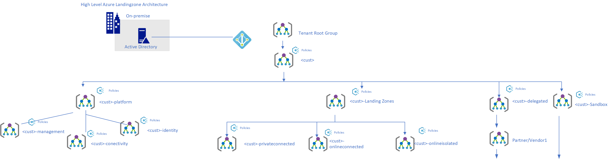

# Management Group en Subscription Organisatie

## List of related features and user stories in the backlog

- #6509
- #6510
- #6515
- #6518
- #6520
- #6519

## Introduction

Management Groups are used to set policies and RBAC.
Policies and Management group overview: 

#### Management groepen

**Tenant Root Group**

The default root management group will not be used. SAAS will be separated from corporate IT management group. AN separate Management Group is created to also be able to deviate from policies if necessary.

**\<\<customer name>\>IT**

This is the top-level management group for the  \<\<customer name>\> Cooperate IT Workloads tenant and is the container for all custom role definitions, custom policy definitions, and the  \<\<customer name>\>IT global policy assignments that apply to all subscriptions. There will be the minimum direct role assignment at this level. The policy assignments on this scope are intended to audit the target state for security and only enforce it to a limited extent. Below this level, the platform and landing zone are created with sub management groups of scopes.
 

 
RBAC: Platform Management group owner rights

**Landing Zones**

For all workloads. Below a sub-level has been created to be able to implement deviating policies and RBAC. 

**\<\<customer name>\>IT-privateconnected,  \<\<customer name>\>IT-onlineconnected,  \<\<customer name>\>IT-onlineisolated,  \<\<customer name>\>IT delegated**

-  \<\<customer name>\>IT-privateconnected: Workloads that do not require a public IP and disconnection and do use a central identity or access other workloads via a private connection, intranet high secure environments such as virtual workplaces, management workplaces.
-  \<\<customer name>\>IT-online-connected: Workloads with public disconnection via an Application Gateway with web application firewall but also central identity or access to other services via private network.
-  \<\<customer name>\>IT-onlineisolated: Isolated workloads that do not need any private connectivity, can, for example, access public access API. Can have a vNet for database protection but are not connected. Hirers often include current workloads.
- Delegated: future scenario in which suppliers, partners manage solutions in separate subscriptions. Depending on the workload, network connectivity may or may not be required. 

**Sandbox**

Sandbox is for Application teams and individual users to do tests. 

**Platform**

**Connectivity**

Central managed network infrastructure in which connectivity is arranged end-to-end connectivity for all landing zones within the  \<\<customer name>\>IT Azure platform. Azure resources that are deployed therein are Azure Firewalls, Firewall Policies and and Azure Private DNS Zones. Optionally if necessary, DNS servers will be deployed for the forward lookup towards Azure DNS for the private endpoints, this is a future iteration and can also be combined with the identity subscription. 

**Management**

A dedicated subscription for management, containing services for logging, security alerting and updates. 

**Identity**
A dedicated subscription and network for placing domain controllers in Azure.

The following policies are applied to the Management Group hierarchy and Subscriptions: 

| Policy                                            | Intent                                                        | Assignment scope              | Result                                                                                          |
|---------------------------------------------------|---------------------------------------------------------------|-------------------------------|-------------------------------------------------------------------------------------------------|
| Enforce subscription budget                       | Ensure all subscriptions have a budget associated             |  \<\<customer name>\> management group      | No subscription will allow unlimited spending                                                   |
| Enforce subscription tags                         | Ensure all subscriptions have the required tags               |  \<\<customer name>\> management group      | All subscriptions are tagged properly to identify business unit owner, intent, and cost centre. |
| Allowed regions | Ensure all resources are created in the designated regions    |  \<\<customer name>\> management group      | All resources are compliant per their location                                                  |
| Assign region policy per subscription             | Ensure subscriptions get policy with correct regions assigned |  \<\<customer name>\> management group      | Subscriptions will support regions per their naming convention                                  |
---
 