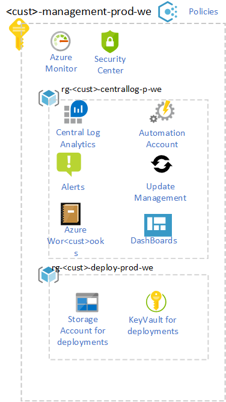

# Management and Monitoring

## List of related features and user stories in the backlog

- #6540
- #6541
- #6542
- #6543
- #6544
- #6545
- #6546
- #6547
- #6548
- #6549

Improvements

- #6636

## Introduction

The monitoring strategy is to use the services available in the Azure platform for logging, security and network monitoring. This means using the Azure native services such as Log Analytics, Monitor, Security Center, Sentinel and Network Watcher.

All core management infrastructure will be in a dedicated Management subscription and governed by Azure Policy; the Monitoring configurations for IAAS and PAAS workloads and subscriptions are policy driven by Azure policy.

Two different management subscriptions will be created for different Log Analytics retention policies. Dev / Test with standard 90 days Acc / Prod with a minimum of 365 days.

See diagram of the components in the management subscription: 

The centralized platform management is the hub for all security and networking monitoring data from IAAS and PAAS components in Azure. With this implementation one achieves:

* A single, central, and horizontal view of the platform on security, auditing, and networking, enforced through Azure Policy and "deployIfNotExists".
   * Consume security data centrally from all subscriptions.
   * Consume networking data centrally from all subscriptions with network deployments.
* Granular data retention per data table in Log Analytics.
* Resource centric and granular RBAC for application teams to access their monitoring data.
* Emergency VM patching and granular VM patching for application teams per RBAC.
* Centralized alerting.
* Centralized, interactive Azure dashboards

AppDevOps Teams can deploy for application performance monitoring Application Insight along with the application and their environment. Optional when central IAAS and PAAS logging require more detail an additional Log Analytics can be deployed in the application subscription.

The following components will be deployed in the management group. 

<table>
<thead>
<tr class="header">
<th>Resource</th>
<th>Resource Group</th>
<th>Parameters</th>
</tr>
</thead>
<tbody>
<tr class="odd">
<td>Log Analytics workspace</td>
<td>rg- \<\<customer name>\>-centrallogging-prod-we</td>
<td>
Workspace name: la- \<\<customer name>\>-centrallogging-prod-we

Location: West Europe
</td>
</tr>
<tr class="even">
<td>Scheduled Log Analytics Query</td>
<td>rg- \<\<customer name>\>-centrallogging-prod-we</td>
<td>
Name: activityquery-la-we

Location: West Europe
</td>
</tr>
<tr class="odd">
<td>ActionGroup</td>
<td>rg- \<\<customer name>\>-centrallogging-prod-we</td>
<td>Receiver: {function https url}</td>
</tr>
<tr class="even">
<td>Azure Function</td>
<td>rg- \<\<customer name>\>-centrallogging-prod-we</td>
<td>Name: azf- \<\<customer name>\>-centrallogging-prod-we-azf 
Location: West Europe</td>
</tr>
<tr class="odd">
<td>Automation account</td>
<td>rg- \<\<customer name>\>-centrallogging-prod-we</td>
<td>
Automation account name: aac- \<\<customer name>\>-centralautomation-we

Location: West Europe
</td>
</tr>
<tr class="odd">
<td>Storage Account</td>
<td>rg- \<\<customer name>\>-centraldeploy-prod-we</td>
<td>
Name: contwemgmtsa01

Location: West Europe
</td>
</tr>
<tr class="even">
<td>Key Vault</td>
<td>rg- \<\<customer name>\>-centraldeploy-prod-we</td>
<td>
Name: contwemgmtkv01

Location: West Europe 
Secrets: GitWebhookURI, GitPATToken
</td>
</tr>

</tbody>
</table>

The following policies for monitoring are proposed

<table>
<thead>
<tr class="header">
<th>Policy</th>
<th>Intent</th>
<th>Assignment scope</th>
<th>Result</th>
</tr>
</thead>
<tbody>
<tr class="odd">
<tr class="odd">
<tr class="even">
<td>Enforce VM logging</td>
<td>Ensure all virtual machines are connected to Log Analytics</td>
<td>Landing Zone management group</td>
<td>Every virtual machine deployed into a Landing Zone will have the Log Analytics VM extension installed and be connected to a Log Analytics workspace</td>
</tr>
<tr class="odd">
<td>Enforce Network Watcher</td>
<td>Deploy Network Watcher on all subscriptions with virtual network</td>
<td> \<\<customer name>\> management group</td>
<td>Every subscription with virtual networks will have associated network watchers deployed per region</td>
</tr>
<tr class="even">
<td>Enforce AD Domain Join</td>
<td>Deploys AD domain join VM extension</td>
<td>Corp management group</td>
<td>All VMs within Corp will be connected to Active Directory domain</td>
</tr>
<tr class="odd">
<td>Deny Automation account child resources</td>
<td>Ensure automation account can only be used for central &amp; app centric VM patching</td>
<td>Management subscription</td>
<td>No one can use the automation account for any other purpose than VM patching</td>
</tr>
<tr class="even">
<td>
Enforce diagnostics/metrics to platform workspace

<ul>
<li>
NSG
</li>
<li>
Public IP
</li>
<li>
NIC
</li>
<li>
Recovery Vaults
</li>
<li>
KeyVault
</li>
<li>
Traffic Manager
</li>
<li>
Express Route
</li>
<li>
DNS
</li>
<li>
App Gateway
</li>
</ul></td>
<td>Ensure supported resources will ingest telemetry to Log Analytics</td>
<td>Landing Zone management group</td>
<td>All platform related telemetry is routed to central Log Analytics workspace</td>
</tr>
</tbody>
</table>