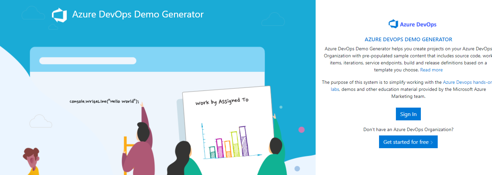
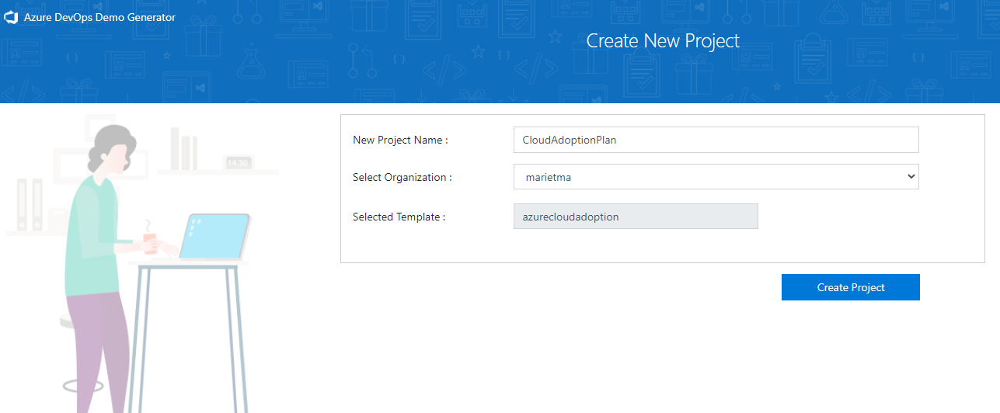

# Sample repository with some generated Azure DevOps Demogenerator templates for reuse

## Azure Cloud Adoption

Modified Azure CLoud Adoption with enterprise landing zone architecture best practices as user stories. Include a wiki that needs to published as code wiki and queries must be changed. The sources of the wiki are in separate repository

### Deployment to Azure DevOps

- Click link below
  
https://azuredevopsdemogenerator.azurewebsites.net/?templateurl=https%3A%2F%2Fgithub.com%2FMathieuRietman%2FDevOpsDemoGeneratorMySamplesTemplates%2Fblob%2Fmaster%2FAzureCloudAdoption.zip&token=&userId=&password=&OldPrivateTemplate=

- Login into the AzureDevOps generator and accept consent

-Fill in Project Name, select your Organization and hit deploy

### Alternative select zip manual.

- Navigate to the Azure DevOps Demo Generator and sign into your DevOps organization.
- Fill in Project Name, select your Organization, and select Choose Template.
- Select Private and either upload the appropriate Zip file or link to the raw - Github link provided in each folder of this repo.
- Select Create Project on the main page.

### After deployment steps

See the readme in the repository in your new project
- Add the code wiki wiki folder as published wiki
- Change the wiki pages to the correct backlog queries. Queries get new numbers in your project.

Link to the wiki repository https://github.com/MathieuRietman/AzureCloudAdoption